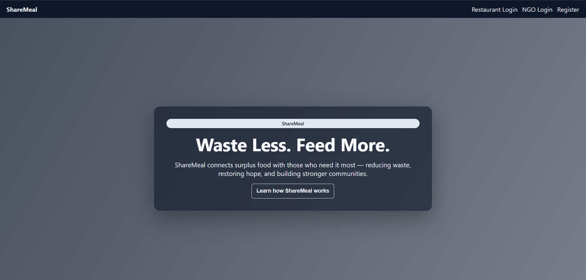
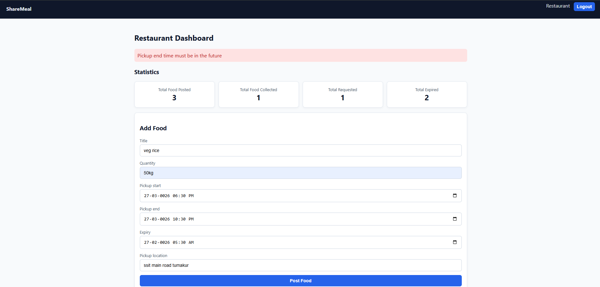
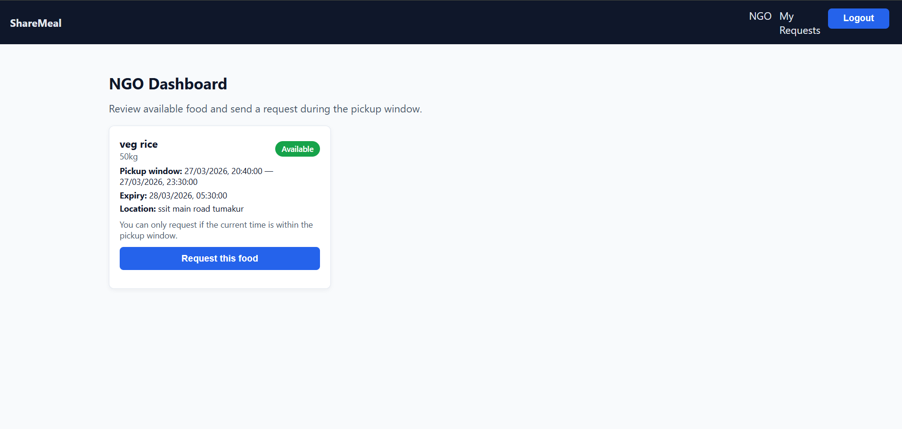

🍽️ Food Redistribution Platform (MERN Stack)
📌 Overview

The Food Redistribution Platform is a full-stack web application designed to reduce food waste by connecting restaurants with NGOs. Restaurants can post surplus food, and NGOs can request and collect it for redistribution to people in need.

The system manages the complete lifecycle of food donations, including pickup time windows, expiry validation, and request approval.

🎯 Problem Statement

Large amounts of food are wasted every day by restaurants and events, while many people struggle with hunger.
This platform bridges that gap by enabling efficient and safe redistribution of surplus food.

🚀 Features
👨‍🍳 Restaurant Dashboard
      Add food donations
      View posted food items
      Track request status
    View statistics:
      Total Food Posted
      Total Food Collected
      Total Requested
      Total Expired
🤝 NGO Dashboard
      View available food donations
      Request food for collection
      Track request status
⚙️ System Features
      Role-based authentication (Restaurant / NGO)
      Food expiry validation
      Pickup time window management
      Request approval workflow
      Automatic expiry handling

🛠️ Tech Stack

Frontend:
  React.js
  Vite
  React Router
  Axios

Backend:
  Node.js
  Express.js
  MongoDB (Mongoose)
  JWT Authentication (JSON Web Token)

📦 Prerequisites
    Node.js (v18 or above)
    npm
    MongoDB (Atlas or Local)

⚙️ Setup Instructions:

   1️⃣ Install Dependencies
            npm install --prefix backend
            npm install --prefix frontend
   2️⃣ Configure Environment Variables
         Backend (backend/.env)
            MONGO_URI=your_mongodb_connection_string
            JWT_SECRET=your_secret_key
            PORT=5000
         Frontend (frontend/.env)
            VITE_API_BASE=http://localhost:5000
   3️⃣ Run Development Servers
          npm run dev --prefix backend
          npm run dev --prefix frontend

🌐 Access
        Frontend: http://localhost:5173
        Backend API: http://localhost:5000
        
🔑 Test Users 

  | Role       | Email                                             | Password |
  | ---------- | ------------------------------------------------- | -------- |
  | Restaurant | [test@restaurant.com](mailto:test@restaurant.com) | 123456   |
  | NGO        | [NGO1@gmail.com](mailto:NGO1@gmail.com)           | NGO1     |

📡 API Routes

   | Module  | Endpoint                                |
   | ------- | --------------------------------------- |
   | Auth    | `/api/auth/register`, `/api/auth/login` |
   | Food    | `/api/food`                             |
   | Request | `/api/request`                          |
   | Stats   | `/api/stats`                            |

📜 Scripts

  Backend
     npm run dev --prefix backend
     npm start --prefix backend

  Frontend
    npm run dev --prefix frontend
    npm run build --prefix frontend
    npm run preview --prefix frontend

    
🔄 Food Lifecycle
      Restaurant posts food
      Food becomes available
      NGO requests food
      Restaurant approves request
      Food status → collected
      If expired → expired
🔮 Future Improvements
      Real-time notifications
      Mobile application
      GPS-based tracking
      Analytics dashboard

## 📸 Screenshots

### 🔐 Login Page

### 👨‍🍳 Restaurant Dashboard

### 🤝 NGO Dashboard

### 🍲 Food Posting Form

👨‍💻 Author

   Sujal M R
   Computer Science Engineering Student
